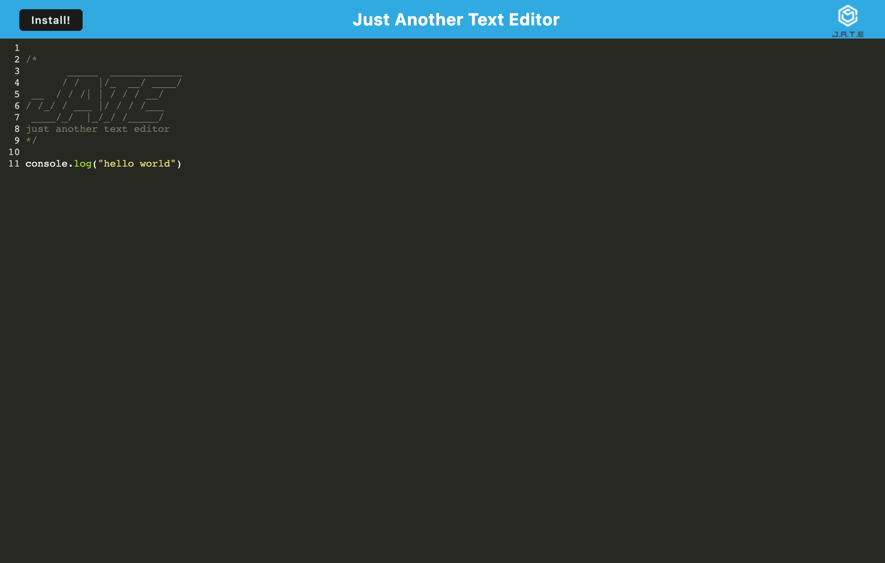

# J.A.T.E-Just-Another-Text-Editor

## Table of Contents

- [Description](#description)
- [Resources](#resources)
- [Contributors](#contributors)
- [Questions?](#questions)

## Description
This project was created using a starter code provided by the University of Toronto, Continuing Studies, Full Stack Developer BootCamp. In this project we are have built a text editor that runs both on the browser and offline. 

Deployed Web App: https://justanothertexteditor-jate-61acdd82d804.herokuapp.com/ 

## Resources
1. Starter Code: https://github.com/coding-boot-camp/cautious-meme
2. All in class activities found in Module 19
3. Activity 28-Stu_Mini-Project 

## Contributors
1. caballero-r
2. Xanderomus
3. Georgeyoo

## Questions?
If you have any questions or concerns about this application please reach out to [caballero-r](https://github.com/caballero-r) or via email to russellncaballero@gmail.com.

